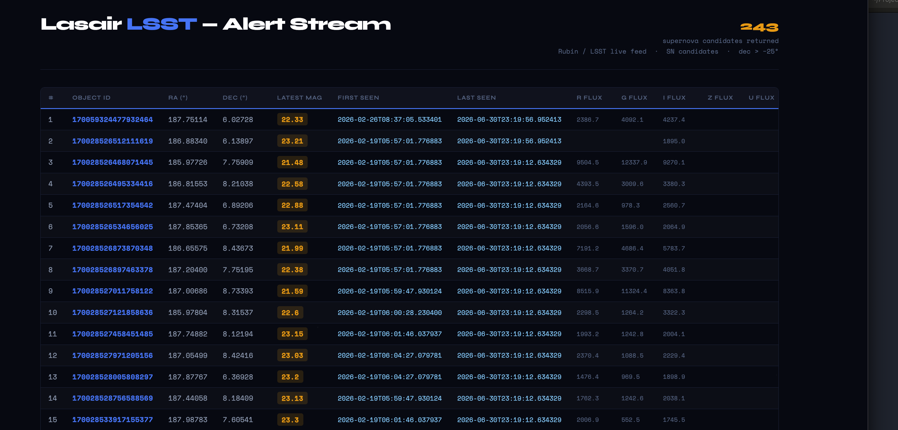
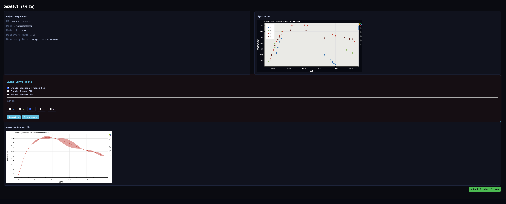

## Welcome to FLARE - 

<p align="center">
  
</p>

<p align="center">
  <b>FLARE</b>
</p>

This is an LSST alert web application designed to fetch LSST alerts and do some preliminary science like light curve fitting.

_Note : This is intended to be working with a TOM_

### Usage
Make a conga env with lasair, sklearn, matplotlib, numpy, django, pandas installed
```
conda activate lasair_env
python manage.py update_alerts
python manage.py runserver
```
This will land you to http://127.0.0.1:8000/

<p align="center">
  
</p>

<p align="center">
</p>

If you click on the light curve symbol it will download and display the light curve on a separate page.
Where you can do gaussian process fit to the light curves in different bands.

<p align="center">
  
</p>

<p align="center">
</p>